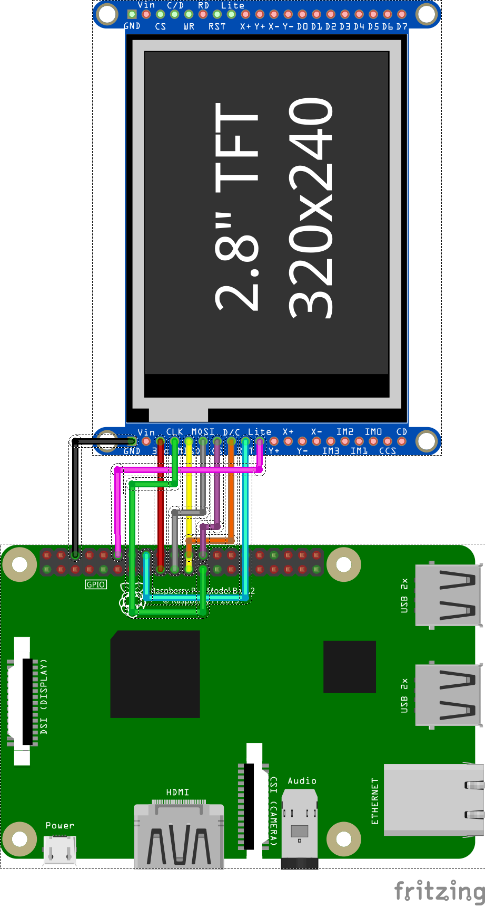

# 1. Table of Content
- [1. Table of Content](#1-table-of-content)
- [2. Introduction](#2-introduction)
  - [2.1. Installation](#21-installation)
  - [2.2. Setup default Audio PCM channel](#22-setup-default-audio-pcm-channel)
  - [2.3. Auto-start setup](#23-auto-start-setup)
  - [2.4. Pin config](#24-pin-config)

# 2. Introduction
A Project to create BlackStart Foot Swith over USB

## 2.1. Installation

```sh
$ git clone --recursive https://github.com/pranjalchanda08/Blackstar_FootSwitch.git
$ cd Blackstar_FootSwitch
$ chmod +x env_setup.sh
$ ./env_setup.sh
```

## 2.2. Setup default Audio PCM channel

```sh
$ aplay -l
```
- List the Card number and device ID

```sh
$ sudo nano /usr/share/alsa/alsa.conf
```

- Replace `defaults.pcm.card {}` and `defaults.pcm.device {}` as required

## 2.3. Auto-start setup

```sh
$ sudo systemctl enable nodered.service
$ crontab -e
```
- Add following lines at the last and save

```txt
@reboot cd /home/pi/Blackstar_FootSwitch/Foot_Swich; python3 Tft.py
@reboot cd /home/pi/Blackstar_FootSwitch/Foot_Swich; python3 foot_switch.py
```

## 2.4. Pin config


| Pin Type |Connection Name | BCM Pin Map | Pin Number|Direction|
|--|----------|-------------|-----------|----|
|GPIO|||||
||Patch up  | GPIO 05 | Pin 29 | Input |
||Patch down  | GPIO 06 | Pin 31 | Input |
||Mod Toggle  | GPIO 13 | Pin 33 | Input |
||Delay Toggle  | GPIO 19 | Pin 35 | Input |
||Reverb Toggle  | GPIO 26 | Pin 37 | Input |
||TFT D/C|GPIO 25 |Pin 22| Output |
||TFT RST|GPIO 23 |Pin 16| Output |
||TFT LED|GPIO 18 (PWM)|Pin 12| Output |
|SPI1 Master||||
||TFT MOSI|GPIO 10 (MOSI)|Pin 19| Output |
||TFT MISO|GPIO 9 (MISO)|Pin 21| Input |
||TFT SCK| GPIO 11 (SCK)|Pin 23| Output |
||TFT CS|  GPIO 8 (CE0)|Pin 24| Output |
|Power||||
||Common +3v3|3v3 Pwr|Pin 1| N/A |
||Common GND|GND|Pin 14| N/A |

